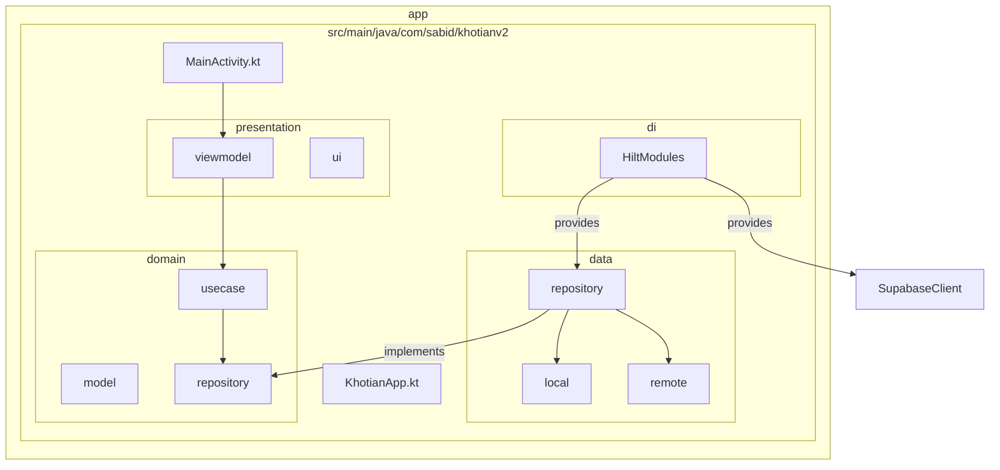

# Khotian New - Project Initialization

This project is initialized with **MVVM + Clean Architecture**, **Dagger Hilt** for dependency injection, and **Supabase Kotlin SDK**.

## Project Structure

## Layers Description

- **Data Layer**: Responsible for data sources (Remote: Supabase, Local: Room). Implementation of repositories.
- **Domain Layer**: Contains Business Logic. Defines Repository Interfaces, Models, and UseCases.
- **Presentation Layer**: UI (Jetpack Compose) and ViewModels.
- **DI (Dagger Hilt)**: Dependency Injection setup for the entire app.

## Technologies Used

- **Jetpack Compose**: Modern UI toolkit.
- **Dagger Hilt**: Dependency Injection.
- **Supabase Kotlin SDK**: Backend as a Service (Auth, Database, Realtime).
- **Kotlinx Serialization**: JSON serialization.
- **Ktor**: HTTP client for Supabase.
- **Room**: Local persistence.

## Setup Instructions

1.  **Supabase Configuration**: Update `SupabaseModule.kt` with your `supabaseUrl` and `supabaseKey`.
2.  **API Keys**: Do not commit real keys to version control. Use `local.properties` or environment variables for production.

render_diffs(file:///C:/Users/Administrator/AndroidStudioProjects/KhotianNew/app/build.gradle.kts)
render_diffs(file:///C:/Users/Administrator/AndroidStudioProjects/KhotianNew/gradle/libs.versions.toml)
